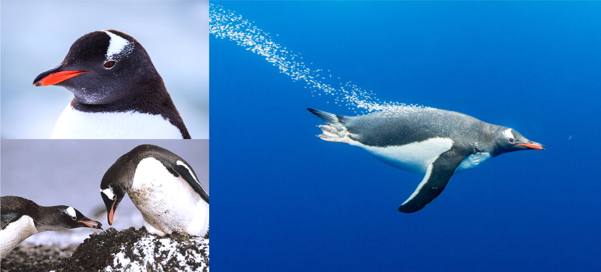

<link href="stylesheet.css" rel="stylesheet"></link>

# cyberdux_duckguin
***An aquatic avian menagerie***

# Quickstart
Add your penguin and name as we learn a little more about GitHub and aquatic avians. All contributions are welcome, it is our aim to create conflict with this project. Despite what our name may suggest, we don't bite!

# Meet the menagerie
- [African Penguin 🐧](african-penguin-🐧) 
- [Chinstrap](chinstrap)
- [Gentoo Penguin](gentoo-penguin)
- [Little Blue](little-blue)
- [Macaroni Penguin](macaroni-penguin)
- [Magellanic penguin](magellanic-penguin) 
- [Rockhopper](rockhopper)
- [Royal Penguin](royal-penguin)
- [Yellow-eyed](yellow-eyed)

 

# Learn some more about our members
### African Penguin 🐧
Contributed by [@sparks-gen](https://github.com/sparks-gen)  
It might seem basic, but overlooking basics can have some detrimental effects. In this case, the African Penguin (affectionately known as the Cape Penguin) is currently critically endangered<a href="https://en.m.wikipedia.org/wiki/African_penguin">1</a>.

In my research on the topic, I learned two things:
1. They are the only penguins that (naturally) occur in "The Old World"<a href="https://en.m.wikipedia.org/wiki/African_penguin">1</a>.
2. "The Old World" is a term applied to Asia, Europe and Africa, to note the known world before the discovery of the Americas and Australia<a href="https://en.m.wikipedia.org/wiki/Old_World">2</a>.

 

### Chinstrap
Contributed by [DevonAllies](https://github.com/DevonAllies), [MichellePrk](https://github.com/MichellePrk)  
  * The chinstrap penguin (**Pygoscelis antarcticus**) gets its name from the narrow black band under its head, and inhabits a variety of islands and shores in the Southern Pacific and the Antarctic Oceans.

Chinstrap penguins can be found mainly on the Antarctic Peninsula and on islands in the South Atlantic Ocean. Their conservation status is "least concern", however numbers are declining because of reduction in krill. They forage any time of the day or night but concentrate efforts around midnight and noon. Unlike other penguin species they lay two eggs and nurture both chicks during the summer months. Chinstrap penguins can live to be 16-20 years old.

 

### Gentoo Penguin
Contributed by [@AlicenJoyHenning](https://github.com/AlicenJoyHenning)  
Beyond their elegant aesthetics, Gentoo penguins are renowned for their remarkable agility, holding the title of the world's fastest underwater birds<a href="https://www.britannica.com/animal/gentoo-penguin">1</a>. These penguins made their Hollywood debut in 2007 with the beloved animated character, Lani, in *Surf's Up*<a href="https://surfs-up.fandom.com/wiki/Lani_Aliikai">2</a>. Gentoo penguins are also known for partaking in a human-like courtship ritual—offering a pebble in exchange for a lifetime partnership<a href="https://www.bbcearth.com/news/the-gift-to-win-a-penguins-heart">3</a>. With their multifaceted charm, these flightless birds are sure to speedily find their way into your heart.   

 

**Image sources:** <a href="https://www.josephfiler.com/photo/antarctica-penguin-3986/">top left</a>, <a href="https://ar.inspiredpencil.com/pictures-2023/gentoo-penguins-pebble">bottom left</a>, <a href="https://www.snexplores.org/article/penguin-swimming-physics-fastest-speed">right</a>. 

 

### Little Blue
Contributed by [Kimmiecc19](https://github.com/Kimmiecc19)  
(of the rainbow variety)

 

### Macaroni Penguin
Contributed by [emma-kruger](https://github.com/emma-kruger)  
Macaronis are the most abundant species of penguin, with 18 million individuals worldwide, spread out over the Subantarctic to Antarctic Peninsula.

This penguin’s name refers to a style of hat worn in the 18th century - a man who wore a flashy feather in his hat was called a “Macaroni” (referring to the striking crest feathers of the penguin - stylish gentlemen!).

Their diet consists mainly of crustaceans, squid and fish.

They can hop as well as waddle.

 

 

### Magellanic Penguin
Contributed by [ChipoManda](https://github.com/ChipoManda)  
Magellanic penguins are medium-sized penguins named after the explorer Ferdinand Magellan, who first spotted them in 1520.

They have a habit of braying like donkeys when communicating, earning them the nickname "jackass penguins" among locals.

These birds sport a distinctive "formal wear" appearance with a black back, white belly, and two black bands across their chest that look like a dapper tuxedo with a double belt.

Standing about 2 feet tall and weighing 8-14 pounds, they're natural swimmers that can dive up to 300 feet deep and swim at speeds of 15 mph.

Despite their waddling walk on land, they transform into underwater acrobats when hunting for anchovies, squid, and krill.

These sociable birds form large breeding colonies along the coasts of Argentina, Chile, and the Falkland Islands.

The species is currently listed as near threatened by the The International Union for Conservation of Nature (IUCN).

They face threats from overfishing, oil pollution, climate change, and human disturbance.

Conservation efforts like protected areas, pollution control, and global teamwork give hope for their survival.
 

### Rockhopper
Contributed by [abhi18av](https://github.com/abhi18av), [@EliznaM](https://github.com/EliznaM)  
I used this [Source]([url](https://www.aquarium.co.za/animals/northern-rockhopper-penguin)) to extract some information about our "friendly" neighbourhood penguins.

Rockhopper penguins are the smallest of the crested penguin species. They live on rocky, inaccessible coasts in the South Atlantic and Indian Oceans.
They are renowned for their incredible jumping ability. Rockhoppers lay two eggs and protect them aggressively.
Parents take turns incubating the eggs, of which only one normally hatches.
 

### Royal Penguin
Contributed by [@gvds](https://github.com/gvds)  
According to Wikipedia, *Eudyptes schlegeli* is found only on the sub-Antarctic Macquarie and adjacent islands.

It is very similar in appearance to the macaroni penguin, with which it occasionally interbreeds, but is distinguished from that species by its white face.

Royals generally lay two eggs, but typically, only incubate the second. Both parents share in this responsibility, rotating in 12-day shifts.

The royal penguin is classified in the IUCN Red List of Threatened Species as 'Least Concern' and its numbers are slowly increasing in the wild.
 

 

### Yellow-eyed
Contributed by [emilyncosta](https://github.com/emilyncosta)  
What Wikipedia says about me: The yellow-eyed penguin, known also as hoiho (very cute, uh?!), is a species of penguin endemic to New Zealand. It is the sole extant species in the genus Megadyptes (uau!). Previously thought closely related to the little penguin, molecular research has shown it more closely related to penguins of the genus Eudyptes (surpriiiise!). I am part of an endangered population :( !
 

 
