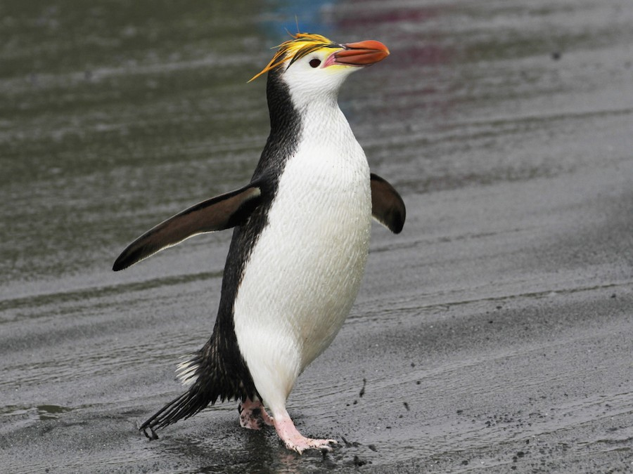

<link href="stylesheet.css" rel="stylesheet"></link>

# cyberdux_duckguin

***An aquatic avian menagerie***

## Introduction

It is our aim to create conflict with this project.

### Royal Penguin *(Gian)*

According to Wikipedia, *Eudyptes schlegeli* is found only on the sub-Antarctic Macquarie and adjacent islands.

It is very similar in appearance to the macaroni penguin, with which it occationally interbreeds, but is distinguised from that species by its white face.

Royals genereally lay two eggs, but typically, only incubate the second. Both parents share in this responsibility, rotating in 12-day shifts.

The royal penguin is classified in the IUCN Red List of Threatened Species as 'Least Concern' and its numbers are slowly increasing in the wild.

### Rockhopper *(Abhi, Elizna)*

### Add your penguin *(and your name)*
